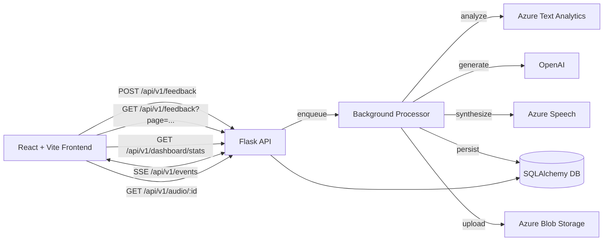

## Project Documentation

### Overview

An end-to-end feedback analysis app that:

- Accepts user feedback
- Analyzes sentiment (Azure Text Analytics)
- Generates a contextual AI response (OpenAI)
- Optionally synthesizes an emotion-aware audio reply (Azure Speech)
- Streams live status updates to the UI via SSE and displays results on a dashboard

### Architecture



Key flows:

- Submit feedback → queued → sentiment → AI response → (optional) audio → DB/Blob → SSE updates to UI
- UI also polls paginated feedback and stats; processing items auto-refresh

### Tech Stack

- Frontend: React 19, TypeScript, Vite, Tailwind, Radix/Shadcn UI
- Backend: Flask, SQLAlchemy, Gunicorn
- AI/Cloud: Azure Text Analytics, Azure Speech, Azure Blob Storage, OpenAI
- CI/CD: GitHub Actions (Azure Static Web Apps, Azure Container Apps)

### Local Setup

Prerequisites: Node.js 20.19+, Python 3.11+

1. Create `.env.local` at repo root with:

```
SECRET_KEY=dev-secret
AZURE_TEXT_ANALYTICS_ENDPOINT=...
AZURE_TEXT_ANALYTICS_KEY=...
AZURE_SPEECH_KEY=...
AZURE_SPEECH_REGION=...
AZURE_STORAGE_CONNECTION_STRING=...
OPENAI_API_KEY=...
OPENAI_MODEL=gpt-4o   # optional; defaults to gpt-4o
CORS_ORIGINS=http://localhost:3000
```

1. Run (from repo root):

```
chmod +x dev.sh
./dev.sh
```

Apps:

- Frontend: http://localhost:3000
- Backend: http://localhost:5001
- Health: http://localhost:5001/api/v1/health

Notes:

- In development, missing env vars cause startup to exit with a helpful message (`backend/application.py`).
- In production, all critical env vars are required and validated on boot.

### API Reference

- GET `/api/v1/health`
  - Returns service and DB status

- POST `/api/v1/feedback`
  - Body: `{ "text": string (>=10, <=5000), "category": "general|service|product|support|billing|technical" }`
  - Returns created feedback; processing starts asynchronously

- GET `/api/v1/feedback/:id`
  - Returns feedback with related `sentiment_analysis`, `ai_response`, `audio_file`, `audio_url`

- GET `/api/v1/feedback?page=&per_page=&category=`
  - Paginated list; ordered by `created_at desc`

- GET `/api/v1/audio/:audio_id?download=true|false`
  - Streams audio from Blob (if available) or local file

- GET `/api/v1/events` (SSE)
  - Emits `{ type: "connected" | "heartbeat" | "feedback_update", data?: Feedback }`

Error shape (typical): `{ status: "error", message: string, code?: string }`

### Data Model (key fields)

- `feedback`:
  - `id`, `text`, `category`, `processing_status` (processing|completed|failed), timestamps
  - Relations: `sentiment_analysis` (1:1), `ai_response` (1:1), `audio_file` (1:1)

- `sentiment_analysis`:
  - `feedback_id`, `sentiment` (positive|negative|neutral), `confidence_score`

- `ai_responses`:
  - `feedback_id`, `response_text`, `model_used`

- `audio_files`:
  - `feedback_id`, `file_path` (ephemeral `/tmp` path during synthesis), `blob_url?`, `file_size?`, `storage_type` (local|blob)

Indexes are added for common queries (status, created_at, category, sentiment).

### Processing Lifecycle

1. Submission: create `feedback` (status `processing`) → queue job
2. Sentiment: Azure TA (fallback heuristic if unavailable) → persist → SSE update
3. AI Response: OpenAI (HTTP) with prompt context → persist → SSE update
4. Audio (optional): Azure Speech SSML with emotion style → save/upload → persist → SSE update
5. Final status: `completed` (or `failed` on error) → SSE update

SSE keeps dashboard responsive; `frontend/src/hooks/use-dashboard.ts` also refreshes items still `processing`.

### Speech synthesis: voices and emotion styles

- Voice selection
  - Positive sentiment → `en-US-JennyNeural`
  - Negative/Neutral sentiment → `en-US-AriaNeural`

- Emotion style by confidence thresholds
  - Positive (JennyNeural)
    - 0.95 → `excited`

    - 0.90 → `cheerful`

    - 0.75 → `hopeful`

    - else → `friendly`

  - Negative (AriaNeural)
    - 0.95 → `hopeful`

    - 0.90 → `empathetic`

    - 0.75 → `friendly`

    - else → `customerservice`

  - Neutral (AriaNeural)
    - 0.95 → `customerservice`

    - 0.90 → `chat`

    - 0.75 → `friendly`

    - else → `empathetic`

- Style intensity (`styledegree`)
  - 0.95 → `1.3`, &gt; 0.90 → `1.2`, &gt; 0.75 → `1.1`, else → `1.0`

- Prosody
  - Defaults to engine values (`rate: default`, `pitch: default`); text is safely escaped for SSML.

### Frontend Structure (essentials)

- `components/FeedbackForm.tsx`: submits feedback (react-hook-form + zod)
- `components/Dashboard.tsx`: stats, paginated feedback, refresh controls
- `hooks/use-dashboard.ts`: loads stats/feedback, merges SSE updates, auto-refreshes processing items
- `services/sseService.ts`: robust SSE with watchdog and reconnect
- `services/audioManager.ts`: singleton audio playback with preload/cache
- UI: Tailwind + Shadcn + Radix; mobile-first, minimal state, clear UX

### Deployment & CI/CD

- Frontend → Azure Static Web Apps via `.github/workflows/azure-frontend.yml`
  - Requires `AZURE_STATIC_WEB_APPS_API_TOKEN`, `REACT_APP_API_URL`
- Backend → Azure Container Apps via `.github/workflows/deploy-container-apps.yml`
  - Builds/pushes Docker image to ACR and updates Container App
  - Requires ACR creds, `AZURE_CREDENTIALS`, and runtime env vars (Azure keys, OpenAI, SECRET_KEY, CORS_ORIGINS, etc.)

### Configuration & Security

- `SECRET_KEY` required; CORS configured via `CORS_ORIGINS`
- Production: strict env validation, Gunicorn with thread workers for SSE
- Audio files uploaded to Blob in production; a temporary file is written to `/tmp` during synthesis and then cleaned up (no project-level `audio_files/` directory)

### Troubleshooting

- Backend exits at startup: missing env vars; check `.env.local` (dev) or Container Apps settings (prod)
- SSE not updating: verify `/api/v1/events` reachability, CORS, and network; check server logs
- Audio 404: ensure Speech and Blob credentials; confirm `audio_files` DB row and blob existence in the container
- Long waits on first request: cold start; CI/CD deploy just finished or container scaled to zero
